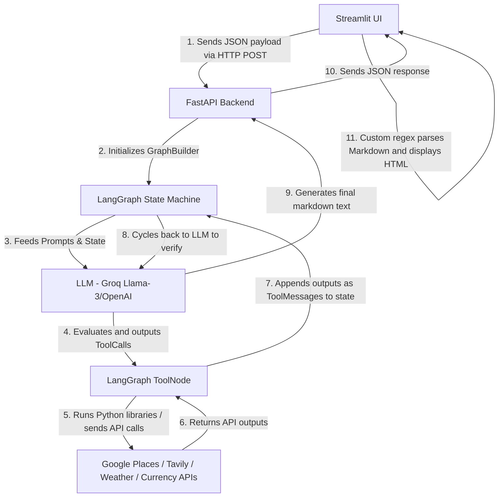

# 🌍 AI Travel Planner: Interview Presentation & Pitch Guide

This guide is designed to help you confidently present your **AI Travel Planner** project to interviewers. It breaks down the system into simple talking points, architectural concepts, and scaling strategies.

---

## 🚀 Part 1: How to Pitch the Project (60-Second Summary)

*Use this structure when an interviewer says, **"Tell me about this project."***

> "I built an **AI Travel Planner** that generates customized, day-by-day travel itineraries based on dates, budgets, and travel styles. 
>
> Architecturally, it’s a decoupled application: I built the frontend with **Streamlit** for a rich, interactive UI, and the backend with **FastAPI**.
>
> The core intelligence is built using **LangGraph**. Instead of just sending a single prompt to an LLM, I designed an **agentic loop (ReAct pattern)**. The agent determines what information it needs, dynamically invokes custom Python tools I built (like Weather API, Currency Exchange API, and Google Places/Tavily search engines), processes their responses, and iterates until it creates a highly accurate, budget-checked itinerary. 
> 
> A key design pattern I focused on was **resilience**: if the primary Google search engine fails or lacks API keys, the system automatically falls back to Tavily Search so the user never encounters a crash."

---

## 🏗️ Part 2: Project Architecture & Flow (Explained simply!)

To make sure anyone—even a child—can understand how our app works, let's look at it through a simple story: **The Restaurant Analogy**.

### 🍔 The Restaurant Story (ELI5 - Explain Like I'm 5)
Imagine you go to a very fancy restaurant to order a custom-made sandwich:

1. **The Customer (Streamlit Frontend)**: You sit at a table and fill out a card: *"I want a sandwich, my budget is $10, and I want it to be healthy."*
2. **The Waiter (FastAPI Backend)**: The waiter takes your card, runs into the kitchen, and reads it out loud. The waiter does not make the sandwich; they just carry the order between you and the kitchen.
3. **The Smart Head Chef (LLM Agent)**: The chef gets the card. The chef is super smart, but they are stuck inside the kitchen. They don't know if the tomatoes are fresh today, what ingredients cost, or what the weather is like.
4. **The Assistant Helpers (Python Tools)**: The Chef calls their assistants to do specific chores:
   * **Assistant 1 (Google Places / Tavily)**: *"Go find out which local farms have fresh tomatoes today."*
   * **Assistant 2 (Currency Converter)**: *"Check how much these ingredients cost in our local currency."*
   * **Assistant 3 (Calculator)**: *"Add up all the costs to make sure we don't go over the $10 budget."*
5. **The Chef's Decision Loop (LangGraph)**: The assistants run out, fetch the details, and report back to the Chef. The Chef reads their reports, thinks for a second, and decides if they need to send another helper. If everything is perfect, the Chef plates the sandwich.
6. **The Delivery**: The Waiter (FastAPI) carries the delicious sandwich back to you (Streamlit) so you can enjoy it on your table!

---

### 💻 The Technical Flow (For the Interviewer)

Here is how that story translates into real computer code step-by-step:

#### Step 1: User Input Form
* **File involved**: [streamlit_app.py](file:///c:/Users/jayan/OneDrive/Desktop/travel/streamlit_app.py)
* **What happens**: The user enters their travel inputs (dates, budget, interests) into the Streamlit web interface. When they click the "Generate" button, this file compiles a JSON payload and makes an HTTP POST request to the `/query` endpoint of the FastAPI backend.

#### Step 2: Backend API Endpoint & Request Parsing
* **File involved**: [main.py](file:///c:/Users/jayan/OneDrive/Desktop/travel/main.py)
* **What happens**: The FastAPI backend receives the request at the `/query` route. It parses the incoming Pydantic `QueryRequest` schema, simplifies the budget description (mapping it to internal keywords), and instantiates `GraphBuilder` class to compile the agentic graph workflow.

#### Step 3: LLM Engine Loading & YAML Configurations
* **Files involved**: [utils/model_loaders.py](file:///c:/Users/jayan/OneDrive/Desktop/travel/utils/model_loaders.py), [utils/config_loader.py](file:///c:/Users/jayan/OneDrive/Desktop/travel/utils/config_loader.py), and [config/config.yaml](file:///c:/Users/jayan/OneDrive/Desktop/travel/config/config.yaml)
* **What happens**: The `GraphBuilder` constructor calls `ModelLoader` in [model_loaders.py](file:///c:/Users/jayan/OneDrive/Desktop/travel/utils/model_loaders.py). The loader calls `load_config` in [config_loader.py](file:///c:/Users/jayan/OneDrive/Desktop/travel/utils/config_loader.py) to read the configuration from [config.yaml](file:///c:/Users/jayan/OneDrive/Desktop/travel/config/config.yaml), parses the model names (like Groq's Llama-3 or OpenAI's GPT models), and loads the active LLM engine instance.

#### Step 4: Compiling the LangGraph State Machine
* **File involved**: [agent/agentic_workflow.py](file:///c:/Users/jayan/OneDrive/Desktop/travel/agent/agentic_workflow.py)
* **What happens**: The `GraphBuilder` sets up a cyclical state diagram using LangGraph's `StateGraph`. It adds our core nodes: `"agent"` (mapped to `agent_function`) and `"tools"` (mapped to LangGraph's prebuilt `ToolNode`). It sets up the starting edge, links nodes, and compiles the diagram into a runnable state machine.

#### Step 5: System Prompt Compilation
* **Files involved**: [prompt_library/prompt.py](file:///c:/Users/jayan/OneDrive/Desktop/travel/prompt_library/prompt.py) called by [agent/agentic_workflow.py](file:///c:/Users/jayan/OneDrive/Desktop/travel/agent/agentic_workflow.py)
* **What happens**: The graph builder calls `create_system_prompt()` in [prompt.py](file:///c:/Users/jayan/OneDrive/Desktop/travel/prompt_library/prompt.py). This function constructs a customized system prompt (detailing constraints like the specific budget guidelines, target dates, and instructions for ambiguous destinations) and attaches it to the model context.

#### Step 6: Tool Binding & LLM Execution Loop
* **File involved**: [agent/agentic_workflow.py](file:///c:/Users/jayan/OneDrive/Desktop/travel/agent/agentic_workflow.py) (The `"agent"` node)
* **What happens**: The node executes `self.llm_with_tools.invoke(user_input)`. The LLM receives the system prompt and conversation state. If the LLM determines it needs real-time data to answer, it returns structured tool call instructions, which LangGraph routes to the `"tools"` node (`ToolNode`).

#### Step 7: Tool Execution & API Integration (Action Node)
* **Files involved**: The `"tools"` node routes to specific tool classes, which invoke helper scripts:
  * **Attractions & Places**: [tools/place_search_tool.py](file:///c:/Users/jayan/OneDrive/Desktop/travel/tools/place_search_tool.py) calls [utils/place_info_search.py](file:///c:/Users/jayan/OneDrive/Desktop/travel/utils/place_info_search.py) (runs queries via Google Places API or Tavily Web Search fallback).
  * **Weather Updates**: [tools/weather_info_tool.py](file:///c:/Users/jayan/OneDrive/Desktop/travel/tools/weather_info_tool.py) calls [utils/weather_tool.py](file:///c:/Users/jayan/OneDrive/Desktop/travel/utils/weather_tool.py) (queries OpenWeatherMap API).
  * **Currency Conversion**: [tools/currency_conversion_tool.py](file:///c:/Users/jayan/OneDrive/Desktop/travel/tools/currency_conversion_tool.py) calls [utils/currency_converter_tool.py](file:///c:/Users/jayan/OneDrive/Desktop/travel/utils/currency_converter_tool.py) (queries ExchangeRate API).
  * **Budget Arithmetic**: [tools/expense_calculator_tool.py](file:///c:/Users/jayan/OneDrive/Desktop/travel/tools/expense_calculator_tool.py) calls [utils/expense_calculator.py](file:///c:/Users/jayan/OneDrive/Desktop/travel/utils/expense_calculator.py) (calculates total costs and daily budget averages).
* **Return path**: Once these tools return string answers, LangGraph appends them to the chat history state and routes control back to the `"agent"` node in [agent/agentic_workflow.py](file:///c:/Users/jayan/OneDrive/Desktop/travel/agent/agentic_workflow.py) to reason again.

#### Step 8: Document Saving & Response
* **Files involved**: [main.py](file:///c:/Users/jayan/OneDrive/Desktop/travel/main.py) calls [utils/save_to_document.py](file:///c:/Users/jayan/OneDrive/Desktop/travel/utils/save_to_document.py)
* **What happens**: Once the LLM completes the travel plan, the graph stops and returns the output to [main.py](file:///c:/Users/jayan/OneDrive/Desktop/travel/main.py). The server calls `save_document()` in [save_to_document.py](file:///c:/Users/jayan/OneDrive/Desktop/travel/utils/save_to_document.py), which compiles a timestamped Markdown document and saves it locally in the `/outputs` folder. The final text is then returned as a JSON response to Streamlit.

#### Step 9: HTML Compilation & UI Rendering
* **File involved**: [streamlit_app.py](file:///c:/Users/jayan/OneDrive/Desktop/travel/streamlit_app.py)
* **What happens**: The frontend receives the JSON response. It runs custom text parser helper functions (`markdown_to_html` and `parse_bold`) to convert the Markdown itinerary into HTML markup structured with custom CSS cards, colors, and layouts, and renders it on the user's dashboard screen.

---

## 📈 Part 3: Future Improvements / Scale Questions

*Interviewers love to ask: **"If you had more time, what would you add?"** or **"How would you scale this?"***

You can answer with these **three senior points**:

1. **Database Persistence**: "Right now, the agent state is kept in memory. I would add a database like PostgreSQL or Redis so users can save their itineraries, see their search history, and resume planning sessions later."
2. **Caching External API Calls**: "API calls to Google Places and Weather can be slow and expensive. I would implement caching (e.g., using Redis) so that if multiple users search for 'Tokyo attractions' in the same week, we return the cached results instead of hitting the external APIs repeatedly."
3. **Async Processing**: "Generating a travel plan can take 10-15 seconds. Instead of a blocking synchronous POST request, I would implement an asynchronous background worker system (using Celery/Redis) with WebSockets to stream the travel plan to the frontend in real time as the agent makes progress."
